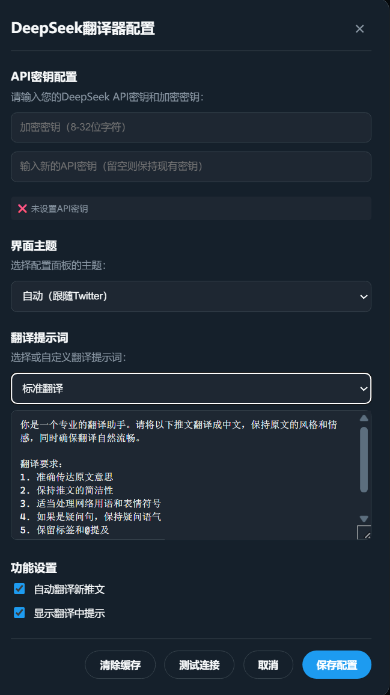

# X/Twitter DeepSeek Translator

[](https://opensource.org/licenses/MIT)
[]()

A powerful Tampermonkey userscript for translating X/Twitter tweets using DeepSeek AI API.

## 🌟 Features

### 🔒 Security
- **Encrypted API Key Storage** - Your API keys are securely encrypted
- **Custom Encryption Key** - User-defined encryption for added security
- **Memory Cleanup** - Automatic sensitive data cleanup

### 🎨 User Experience
- **Multi-Theme Support** - Automatically adapts to Twitter's light, dark, and dim themes
- **Visual Configuration Panel** - Easy-to-use settings interface
- **Real-time API Testing** - Test your configuration before saving

### 🤖 AI Translation
- **DeepSeek Integration** - High-quality translations using state-of-the-art AI
- **Multiple Translation Styles** - Standard, concise, formal, and casual modes
- **Smart Caching** - Avoids duplicate translations and API calls

### ⚡ Performance
- **Auto-Detection** - Automatically detects and translates new tweets
- **Non-Intrusive** - Doesn't interfere with Twitter's normal functionality
- **Efficient Caching** - Remembers translated tweets across page reloads

## 📸 Screenshots

### Configuration Panel


### Translation Example


## 🚀 Installation

### Prerequisites
- [Tampermonkey](https://www.tampermonkey.net/) browser extension

### Installation Steps
1. Install Tampermonkey for your browser
2. Click the installation link: [Install Script](https://fastly.jsdelivr.net/gh/comdotwww/X-Twitter-DeepSeek-Translator@latest/X-Twitter-DeepSeek-Translator.user.js)
3. Confirm installation in Tampermonkey
4. Refresh Twitter/X.com

## ⚙️ Configuration

### Initial Setup
1. Click the "🔧 DeepSeek" button in the bottom-right corner
2. Set an encryption key (8-32 characters)
3. Enter your DeepSeek API key
4. Choose translation style
5. Test connection and save

### API Key Setup
1. Visit [DeepSeek Platform](https://platform.deepseek.com/)
2. Register an account and obtain an API key
3. Free tiers are available for new users

## 🏗️ Architecture

```mermaid
graph TD
    A[Twitter Page] --> B[Userscript]
    B --> C[Config Panel]
    B --> D[Tweet Detector]
    D --> E[Translation Engine]
    E --> F[DeepSeek API]
    E --> G[Cache System]
    G --> H[Display Translator]
